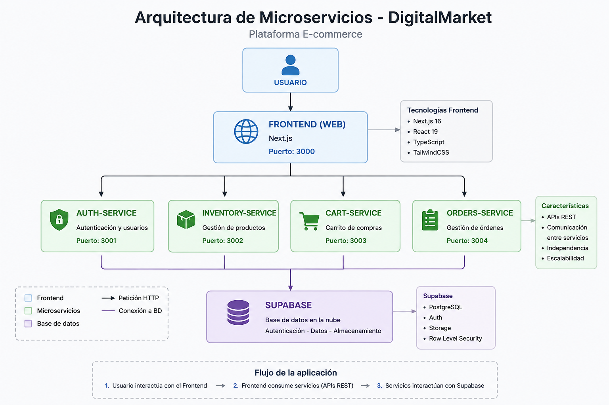

# 🚀 DigitalMarket Monorepo

Plataforma ecommerce moderna basada en arquitectura de microservicios utilizando Next.js, Supabase y Docker.

---

# 📦 Arquitectura

El proyecto fue construido utilizando una arquitectura desacoplada basada en microservicios dentro de un monorepo.

## Microservicios

| Servicio | Puerto | Descripción |
|---|---|---|
| web | 3000 | Frontend principal |
| auth-service | 3001 | Servicio de autenticación |
| inventory-service | 3002 | Gestión de productos |
| cart-service | 3003 | Carrito de compras |
| orders-service | 3004 | Gestión de órdenes |

---

# 🛠 Tecnologías utilizadas

- Next.js 16
- React 19
- TypeScript
- TailwindCSS
- Supabase
- Docker
- Docker Compose
- PNPM Workspaces
- Turborepo

---

# ✨ Funcionalidades

✅ Login de usuario  
✅ Arquitectura de microservicios  
✅ Monorepo profesional  
✅ Gestión de productos  
✅ Carrito de compras  
✅ Checkout  
✅ Historial de órdenes  
✅ Persistencia en Supabase  
✅ APIs REST  
✅ Diseño responsive  
✅ Dockerización del proyecto  

---

# 🗂 Estructura del proyecto

```bash
apps/
 ├── web
 ├── auth-service
 ├── inventory-service
 ├── cart-service
 └── orders-service
 


---


⚙️ Instalación
1. Clonar repositorio
git clone https://github.com/GUIIOVINHO/DigitalMarket-monorepo.git

2. Entrar al proyecto
cd DigitalMarket-monorepo

3. Instalar dependencias
pnpm install

▶️ Ejecutar proyecto
Frontend
pnpm --filter web dev
Auth Service
pnpm --filter auth-service dev
Inventory Service
pnpm --filter inventory-service dev
Cart Service
pnpm --filter cart-service dev
Orders Service
pnpm --filter orders-service dev


🐳 Docker
Levantar todos los servicios
docker-compose up


🧠 Arquitectura implementada
El proyecto implementa:

Arquitectura basada en microservicios
Separación de responsabilidades
APIs desacopladas
Persistencia cloud mediante Supabase
Comunicación frontend/backend mediante REST APIs
Escalabilidad modular


📸 Capturas del proyecto
Dashboard




👨‍💻 Autores

Guiovanni Gómez
Jhanpieer Rodriguez
David Salazar


---
